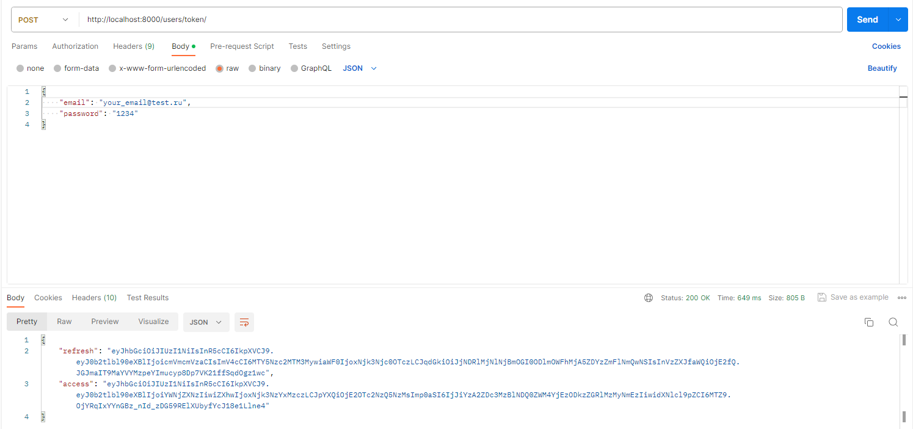
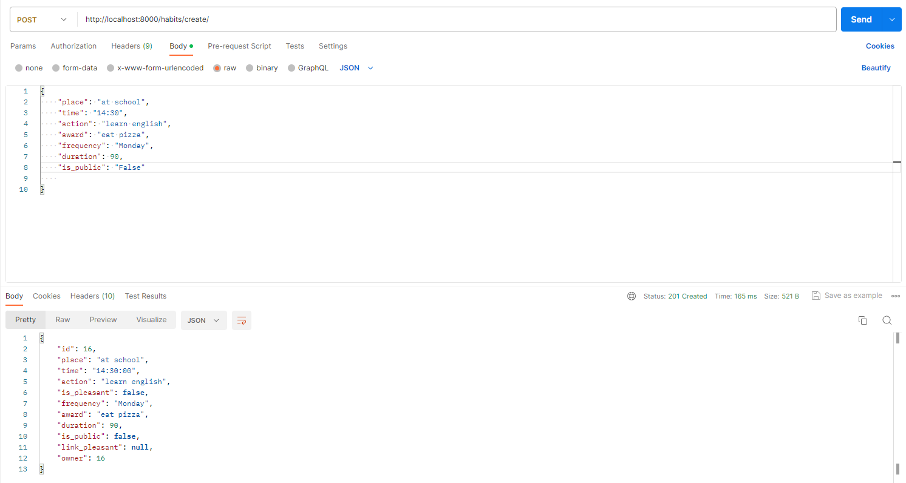

# Habit_tracker

## Description
In 2018, James Clear wrote Atomic Habits, a book about new good habits and mastering old bad habits.
The developed platform allows you to create your own habits and share them with other users. Users will also receive reminders in telegram about the need to complete the habit on time.

## Requirements
- `Python`
- `Redis`
- `PostgreSQL`

## Set Up your personal settings
Create a `.env` configuration file with your personal settings in the root of the project, according to the sample, specified in `.env.sample`. Fill out the file according to your personal data. 

## Prepare
- Run service Redis;
- Create a database in postgresql. The name of the database must match the name specified in the file;
- Migrate your database using command: `python manage.py migrate`;
- Create a telegram bot for send information and paste the token into the `.env` file.

## Running
To run the project, enter the `celery -A config beat -l info -S django` command in the terminal. Open a second terminal window and enter `celery -A config worker -l INFO` (add `eventlet` for Windows). It is necessary to monitor and execute background tasks. 
Then open a new terminal window and run `python manage.py runserver`.
 The project is ready to use!

## Work with API (users)
- http://127.0.0.1:8000/users/registration/ - user registration
- http://127.0.0.1:8000/users/list/ - show all users
- http://127.0.0.1:8000/users/detail/<int:pk>/ - show user's detail information
- http://127.0.0.1:8000/users/update/int:pk/ - update user information
- http://127.0.0.1:8000/users/delete/int:pk/ - delete user information
- http://127.0.0.1:8000/users/token/ - get token for user
- http://127.0.0.1:8000/users/token/refresh/ - refresh user token

## Work with API (habits)
- http://localhost:8000/habits/create/ - create habit
- http://localhost:8000/habits/list/ - show all user's habits
- http://localhost:8000/habits/detail/int:pk/ - show user's habit detail information
- http://127.0.0.1:8000/habits/update/int:pk/ - update habit
- http://127.0.0.1:8000/habits/delete/int:pk/ - delete habit
- http://127.0.0.1:8000/habits/public_list/ - show all public habits

## Requests description
### User model
- email - use your email address to register on the platform
- telegram_user_name - a necessary condition for receiving reminders from a telegram bot (indicate without additional characters before the nickname)
- password - enter your password, don't forget to enter it to receive a token
- password2 - duplicate the password when registering a user for re-verification

### Habit model
- place - place of your habit
- time - when execute habit
- action - what to do
- award - what you will get for his not pleasant habit
- is_pleasant - flag for pleasant or not pleasant habit
- link_pleasant - not pleasant habit can have pleasant habit (in this case no award)
- frequency - by default daily, but you can check day of week (Monday-Sunday)
- duration - duration of habit (less than 120 minutes)
- is_public - flag for public or private habit

## Working with the interface
### User registration

After registration, go to the telegram bot chat and enter the /start command. After this, wait for a response message from the chat bot, it will take no more than 2 minutes. Now you will receive reminders about your habits in this chat!

### Get access token

To work with the platform, authorization is required. To do this, after user registration, use your email and password to receive a token. When sending a request to the platform, use the received token in the Authorization section.

### Create a habit

